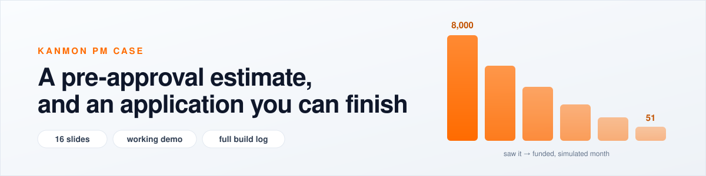

<p align="center">
  <a href="https://ant2624.github.io/kanmon-case/"></a>
</p>

<h1 align="center">The Kanmon PM case</h1>

<p align="center">
  <b><a href="https://ant2624.github.io/kanmon-case/">▶ Open the case</a></b>
  &nbsp;·&nbsp;
  <a href="https://ant2624.github.io/kanmon-case/surfaces/kanmon-demo-experience-20260730.html">Try the demo</a>
  &nbsp;·&nbsp;
  <a href="https://ant2624.github.io/kanmon-case/#effort">Read the build log</a>
</p>

---

One success metric, **originations through partner platforms**. One feature, chosen and built end to end: work out roughly how much a business could borrow **before they ask**, show that number where they already work, and let the same data collapse the application from six screens to one.

The estimate is never a binding offer. Underwriting still decides.

## Start with the presentation

**The presentation is the case**, and it is the view I made for you. Open it first, and let it guide you.

A few of the pages it opens are also built for an audience, the working demo above all, and I bring those up as they help. Everything else, the funnel notes, the research, the build log, my raw notes ([md](raw-notes.md) · [pdf](raw-notes.pdf)), is **my own working material**: organized for me to think and build from, not written for quick reading. Reached through the presentation, in context, it lands the way it should. Opened cold, expect working notes rather than a finished document. That is by design; the presentation is the polished layer, and the rest is the work behind it.

## Pick your depth

| You have | Do this |
|---|---|
| **2 minutes** | [Open the case](https://ant2624.github.io/kanmon-case/). It starts as a presentation. Scroll. |
| **10 minutes** | Add the [demo](https://ant2624.github.io/kanmon-case/surfaces/kanmon-demo-experience-20260730.html): click through the application twice, once as it works today (9 screens, 16 fields, 3 documents) and once with the estimate (6 screens, 1 field, none). The side panel explains why each screen wins or loses people. |
| **30 minutes** | Follow the buttons. Every slide opens the detail behind it: the funnel model, the backlog and trade-offs, the architecture, the US privacy work, my raw notes, and the full build log. A sequence rail on the left keeps you oriented; a button in the corner always brings you back. |

## How this repo is laid out

```
index.html      opens on the presentation (the intended view); behind it sits
                the workbench and build log I worked from
raw-notes.md    my raw notes, verbatim (also raw-notes.pdf) — the thinking this grew from
surfaces/       interactive working pieces: demo, funnel charts, architecture, mocks
notes/          my working notes behind every claim (indexed, not polished for reading)
assets/         images
```

## Honesty notes

- **All volumes are simulated.** I built a practice funnel to reason with. Nothing here is Kanmon's data.
- **The estimate is non-binding by design.** A firm offer of credit carries regulatory obligations, so the wording stays "you could be eligible for up to", never "you are approved for".
- **My main assumption is stated, not hidden.** The feature depends on partners holding enough data to produce a useful estimate. That is the first thing I would validate.

## How I worked with AI

I leaned on AI for research and level setting: embedded lending, the market, the mechanics of originations. The framing, the feature choice, the prioritization, and the cuts are mine. Working from the uploaded case brief, the AI's first feature proposal was "show financing at the perfect moment." I considered it and moved away from it, because it assumes people are finishing applications, and in the numbers they are not.

The [build log](https://ant2624.github.io/kanmon-case/#effort) records every prompt, every judgment call, and what got thrown away.

**Models, roughly:** ~50% Cursor Auto · ~40% Claude Opus 5 · ~5% Claude Opus 4.8 · ~5% Claude Fable 5.

---

<p align="center">Built by Anthony for the Kanmon PM case study. Practice numbers; my opinions.</p>
