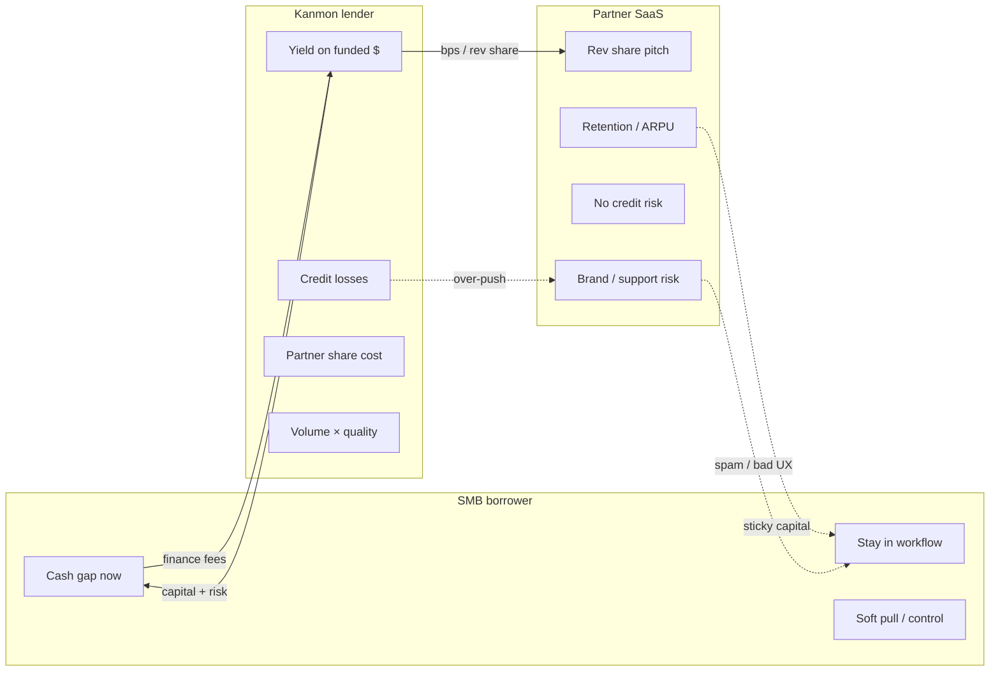

# Kanmon: incentives deep dive (SMB · partner · product · gaps)

**Date:** 2026-07-29  
**Purpose:** Incentive map for Anthony’s Kanmon PM case, why SMBs borrow via partners, why partners distribute, which products the model favors, where incentives misalign, and **what Kanmon isn’t doing publicly** that could move partner originations.  
**Companion summary:** `kanmon-incentives-summary-20260729.md`  
**Note:** “SMS” in prior ask = **SMB** (borrower).

**Labels:** **[FACT]** public source · **[HYP]** industry-typical / interview sketch · **[UNK]** not verified · **[ABSENT-PUBLIC]** no public evidence found (may exist behind gated docs / private ops)

**Primary sources:** `kanmon-source-library/` (esp. Cleo WebEDI KB + partner FAQs), `kanmon-revenue-partner-model-20260729.md`, `kanmon-feature-landscape-20260729.md`, `kanmon-partner-vs-direct-20260729.md`, `kanmon-partner-e2e-examples-20260729.md`, ecosystem extension, kanmon.com, peer sites (Liberis / Pipe / Stripe Capital / Parafin).

---

## Incentive map (one glance)



```
                    ┌──────────────┐
   cash gap ──────►│     SMB      │◄── soft pull, invoice/AP control, speed
   fees / ACH ────►│   borrower   │───► funds (≤24–48h narratives)
                    └──────┬───────┘
                           │ stays in partner workflow
                    ┌──────▼───────┐
   UX + traffic ───►│   Partner    │◄── rev share pitch (% unpublished)
   brand risk ◄────│   SaaS       │───► retention / ARPU claim / differentiation
                    └──────┬───────┘
                           │ distribution only
                    ┌──────▼───────┐
   yield ◄─────────│   Kanmon     │───► capital, UW, soft pull, servicing
   losses ◄────────│   lender     │───► assumes credit risk [FACT]
                    └──────────────┘
```

---

## 1. SMB incentives (why finance via partner)

### Job-to-be-done

Close a **cash gap** without leaving the tool where the cash object already lives (invoice, bill, PO, staffing AR).

### What partner FAQs / KB actually sell **[FACT]**

| Incentive | Evidence |
|-----------|----------|
| **Speed** | Funds often ≤24h / same-day ACH / 24–48h (Cleo, Avionté, PingPong, Cin7 narratives) |
| **Soft pull** | “Does not affect credit score” / soft credit pull (Cleo, PingPong, Nuvei, Kanmon FAQ) |
| **Stay in workflow** | WebEDI Finance button; PingPong Financing tab; Cin7 Money → Capital; Avionté back-office select invoices |
| **Terms 30 / 60 / 90** | Cleo InvoicePay repayment choice; Nuvei choose period per advance |
| **Invoice-level control** | Finance some invoices only, not all-or-nothing factoring (Cleo KB, Avionté SmartFund) |
| **Get paid faster / reduce DSO pressure** | Cleo: convert approved invoices to WC while buyer keeps Net terms |
| **Pay suppliers / inventory** | PingPong AP financing; Cin7 AP / PO framing |
| **No unused-capital fees** (draw-when-needed) | Avionté SmartFund marketing |
| **Early repay flexibility** | Cleo pro-rata fee rebate; PingPong early repay OK |
| **Avoid “traditional debt / factoring” framing** | Cleo KB positioning vs factoring / separate lender portal |

### Economic incentive (cost of capital vs alternatives) **[HYP]** mixed with **[FACT]** alternatives named

Public Kanmon/partner pages **do not publish APR / factor rates**. Interview stance: compare *jobs*, not fake rates.

| Alternative | SMB pain vs Kanmon-in-partner | Label |
|-------------|------------------------------|-------|
| **Wait on AR** | Free capital but payroll/freight/inventory miss; opportunity cost | Economic reality |
| **Bank term / LOC** | Often slower, harder docs, personal guarantee / hard pull more common | Industry pattern **[HYP]** |
| **Invoice factoring** | Can be all-or-nothing, buyer notification, opaque tiers; Cleo explicitly contrasts | **[FACT]** positioning |
| **Cards / float** | Fast but expensive + personal credit friction; poor fit for large AR/AP lumps | **[HYP]** |
| **MCA / % of sales** | Flexible repay; may feel opaque; Kanmon partners more often sell fixed schedule + object finance | Mix **[FACT]** products vs peers |
| **Kanmon via partner** | Pays a finance fee for speed + workflow + soft pull + object control | Fee existence **[FACT]**; rate **unpublished** |

**Call line:**  
> “SMB isn’t buying ‘a loan brand’, they’re buying hours of cash against an object they already see, with soft-pull friction and invoice-level control. Fee must clear vs waiting on AR or factoring hassle.”

### SMB disincentives / frictions **[FACT]** + **[HYP]**

- Bank connect / Plaid abandon **[FACT]** required on several FAQs  
- Late **$25** / NSF **$35** **[FACT]** → regret if mis-scheduled  
- Fixed ACH on 30/60/90 vs KB “when buyer pays” marketing tension (Cleo), servicing surprise risk  
- Offer declines / silent wait ≤3 BD **[FACT]** timing claims → trust hit  
- Cin7 one-product-at-a-time lock **[FACT]** nuance in E2E → wrong product regret **[HYP]**

---

## 2. Partner incentives (why embed Kanmon)

### What Kanmon markets to partners **[FACT]**

| Incentive | Public language / source |
|-----------|--------------------------|
| **Revenue share** | LinkedIn: “basis points on every dollar financed”, **% unpublished**; not a kanmon.com FAQ line |
| **No credit risk** | “Kanmon provides the capital… assumes all credit risk” |
| **Kanmon operates lending** | UW, KYB, soft pull, servicing, collections, compliance |
| **Retention / LTV** | Financing raises switching costs; LinkedIn churn framing |
| **ARPU / CAC** | Blog claim: increase ARPU **2–5×** (self-report, not audited) |
| **Insights** | “Gain insight… target active customers… upsell” |
| **GTM assist** | “Out-of-the-box product marketing support” |
| **Time-to-launch** | Site “~1 week” vs LinkedIn CFO “60–90 days to first origination”, treat as marketing range |
| **Monetize existing traffic** | Platform already has SMB sessions / invoices / bills, no D2C CAC |

### Vertical partner motives (from their pages) **[FACT]**

| Partner | Motive signal |
|---------|---------------|
| **Cleo** | Keep buyer Net terms; suppliers get liquidity inside WebEDI / O2C; fulfillment reliability |
| **PingPong** | E-comm sellers pay supplier bills / growth loans without leaving money product |
| **Cin7** | Inventory brands fund POs / AR beside Money workflows |
| **Avionté** | Staffing payroll vs client pay timing |
| **Nuvei** | A/R advance inside payments / commerce suite |

### Rev share honesty

- **[FACT]** rev share / bps exists as LinkedIn commercial pitch (homepage softer “revenue potential”).  
- **[ABSENT-PUBLIC]** take rate, share formula, volume tiers, payment cadence, clawbacks.  
- **[HYP]** industry embedded SMB lending often shares ~20–40% of fee income or fixed bps on funded $, use only as *illustrative*, never as Kanmon fact (see revenue-model unit-econ sketch).

### CS / success SPIFs

- **[ABSENT-PUBLIC]** No Kanmon or partner page found advertising CS SPIFs, AE bounties, or recommend-capital quotas.  
- **[FACT]** Pipe claims assisted customers take **2× larger advances** (peer marketing), shows category believes human assist matters.  
- **[HYP]** Quiet partners may under-originate because CS has **no** incentive or playbook, even when rev share exists at company level.

### Partner disincentives **[FACT]** framing + **[HYP]**

| Disincentive | Why it matters |
|--------------|----------------|
| **Brand risk** | Spammy capital CTAs → “my SaaS became a lender ad” |
| **Support burden** | Borrowers still ping partner CS; Kanmon owns help@kanmon.com on several FAQs but partner owns relationship |
| **Compliance optics** | Soft-invite defaults; UDAAP / misleading “pre-approved” language |
| **Eng cost / priority** | Financing tab buried vs core roadmap |
| **Credit experience spillover** | Declines / NSF fees reflect on partner brand even if risk is Kanmon’s |

---

## 3. Products the model favors

### Public product set **[FACT]**

Kanmon FAQ / homepage: **term loans · lines of credit · invoice financing · AP financing**.

### What shows up most in partner FAQs / marketing

| Product | Partner surfaces (public) | Relative weight in source library |
|---------|---------------------------|-----------------------------------|
| **Invoice / AR financing** | Cleo InvoicePay (deepest KB), Nuvei A/R, Avionté SmartFund, Cin7 (explicit “provided by Kanmon”) | **Highest narrative density** |
| **AP financing** | PingPong primary path; Cin7 Capital | Strong on payments / inventory partners |
| **Term loans** | PingPong (6–12 mo typical); Cin7; Kanmon homepage verticals | Common secondary / growth |
| **LOC** | Cin7 Capital; Kanmon homepage (practice mgmt etc.) | Present but thinner FAQ stories |

### Why push one product over another

| Driver | Favors | Why |
|--------|--------|-----|
| **Attach to partner workflow object** | Invoice, AP | Object already in UI → higher intent, easier Capital Moment |
| **Repeat use / capital velocity** | Invoice-level advances, AP bill-by-bill, LOC draws | Habitual originations vs one-shot term |
| **Risk / observability** | Invoice (tied to AR), AP (tied to payable) | Underwriting narrative closer to cash object **[HYP]** |
| **Ticket size / yield** | Term, larger LOC | Bigger funded $ per accept, fewer “moments” needed **[HYP]** |
| **Partner differentiation** | Invoice/AP vs generic MCA peers | Kanmon rare public multi-product + invoice/AP (feature landscape) **[FACT]** rarity |
| **SMB mental model** | Match cash-gap type | Wrong product → accept↓ or default↑ **[HYP]** |

### Preferred mix **[HYP: labeled]**

1. **Embedded-native core:** invoice + AP as the *workflow-native* engines (Cleo / Nuvei / Avionté / PingPong pattern).  
2. **Buffer / habit layer:** LOC where partners have ongoing ops cash gaps.  
3. **Lump / growth overlay:** term for inventory peaks / CapEx (PingPong).  
4. **Not MCA-first:** public Kanmon story is multi-product WC, not % of sales advance, unlike Pipe/YouLend/Liberis Flex cores.

**Interview line:**  
> “I’d expect invoice/AP to punch above their weight for *partner-sourced* originations because they’re object-native; term/LOC still matter for ticket size and coverage, but routing at the moment of need matters more than shelf breadth alone.”

---

## 4. Misaligned incentives

| Conflict | SMB wants | Partner wants | Kanmon wants | Failure mode |
|----------|-----------|---------------|--------------|--------------|
| **Conversion vs risk** | Easy yes, fast cash | Happy customers, few complaints | Funded $ *inside loss band* | Spam CTAs / soft eligibility → volume vanity, CM ruin |
| **Partner spam vs originations** | Quiet, relevant offers | Brand-safe UX | More see → start → fund | Aggressive surfaces → partner turns feature off |
| **Rev share richness** | Lower fees | Higher share / visible $ | Keep contribution margin | Over-rich share → Kanmon CM death; under-share → quiet GTM |
| **Object control vs book size** | Finance only some invoices | Sticky habit | Maximize funded $ | Pushing “finance all” → regret / defaults |
| **Speed UW vs accuracy** | Instant offer | Reliable approvals | Correct risk | Fast decline/approve errors → trust + losses |
| **CS assist vs capacity** | Human help | Low ticket load | Larger advances (peer 2× claim) | No SPIF → no assist; SPIF → over-recommend |
| **Multi-product shelf vs choice friction** | Right product | Simple UX | Attach rate | Cin7-style one-at-a-time or no router → wrong product |

**Biggest misalignment for the case:**  
Partner (and growth PM) incentive to **maximize starts/funds** vs Kanmon credit/econ incentive to **protect loss + CM**, while partner brand incentive is to **under-promote** if UX feels spammy. Quiet partners can be either under-incentivized *or* capability-blocked; diagnose before funding SPIFs or shipping louder Moments.

---

## 5. Gaps / white space (capability + incentive)

Compare **public** Kanmon + partner surfaces vs peers (Liberis contextual APIs, Pipe partner portal, Parafin/Stripe pre-approved paths) and vs obvious origination levers.  
Honesty: `kanmon.dev` is invite-gated → many gaps are **[ABSENT-PUBLIC]**, not proof of non-existence.

| Gap | Why it matters for partner originations | Risk / why avoid | Status |
|-----|----------------------------------------|------------------|--------|
| **Upstream Capital Moments / workflow triggers** (vs buried Financing tab) | Moves *see* at true cash gap; Cleo Finance-on-invoice is the gold pattern; PingPong “Financing tab” is weaker intent | Spam/brand; UDAAP; eng cost per vertical object | Liberis ships Adverts API + marketing webhooks **[FACT]**; Kanmon public = marketing “target/upsell” only **[FACT]** → trigger framework **[ABSENT-PUBLIC]** / **[UNK]** behind docs |
| **Quiet-partner reactivation / partner success tooling** | Live integrations with low fund rate = metric death; needs health dashboards, playbooks, QBR packs | Needs data + PS capacity; Series A bench thin | Insights language **[FACT]**; portal depth / quiet-partner ops **[ABSENT-PUBLIC]** vs Pipe portal **[FACT]** |
| **CS recommend-capital workflows** | Pipe: assisted → 2× advance size claim **[FACT]** peer; CS can unlock attach without new SMB acquisition | Brand risk if CS “sells loans”; training/compliance | Industry-wide thin **[UNK]**; Kanmon **[ABSENT-PUBLIC]** agent UI |
| **Transparent partner economics / self-serve rev-share dashboards** | Makes incentive *felt*; partners push what they can see paid | Reveals thin take rate; disputes; sales pressure | Pipe rev share in portal **[FACT]**; Kanmon take rate + dashboard **[ABSENT-PUBLIC]** |
| **Pre-qualification teasers before full apply** | Raises start CVR; reduces surprise declines | Misleading “you’re approved” → compliance/Credit | Soft pull + fast UW **[FACT]**; named pre-approved offer product **[UNK]** / thinner than Parafin/Stripe/YouLend **[FACT]** peers |
| **Cross-product routing at moment of need** | Invoice vs AP vs LOC vs term match → accept↑ regret↓ | Complexity; Cin7 one-type lock tension | Multi-product shelf **[FACT]**; public **router** at moment **[ABSENT-PUBLIC]** |
| **Borrower education / payment calculator in-partner** | Fee clarity → trust, fewer NSF surprises, better product choice | Can scare off converts; must stay accurate | Fee existence + $25/$35 **[FACT]**; calculator UX **[ABSENT-PUBLIC]** in source library |
| **Incentive programs: SPIFs, borrower rate promos, volume tiers** | Pure *incentive* lever when capability already works | Adverse selection; margin giveaway; partner gaming | **[ABSENT-PUBLIC]** for Kanmon; category uses rev share broadly **[FACT]** |
| **Direct SMB channel** | Would add non-partner volume | Cannibalizes partners; fights embedded thesis; CAC | **Strategic non-choice**, public GTM partner-only **[FACT]** (`kanmon-partner-vs-direct`) |
| **Documented webhooks / offer eventing** | Partners automate Moments, email, suppression | Support burden; partner eng maturity | Peers document webhooks **[FACT]**; Kanmon catalog **[UNK]** gated |
| **Progressive / renewal offer orchestration (public)** | Repeat borrow without re-teaching | Credit policy + messaging risk | Progressive limits claimed **[FACT]**; orchestration UX **[ABSENT-PUBLIC]** vs Liberis renewal webhook types |

### Capability vs incentive reading of gaps

| If diagnosis says… | Lean into gaps… | Don’t first… |
|--------------------|-----------------|--------------|
| SMBs don’t *see* capital at cash gaps | Upstream Moments + object CTAs + routing | Richer rev share alone |
| Partners don’t *care* / deprioritize GTM | Visible econ dashboard, launch MDF, CS SPIFs | More SDK surfaces |
| Eligibility/start friction | Soft prequal teasers, bank-link UX, education/calculator | Louder spam CTAs |
| Credit/loss band tight | Better routing + quieter suppression (Liberis-style do-not-market) | Volume SPIFs |

### Tie-back to product favoritism

Gaps that amplify **invoice/AP** (object CTAs, routers, calculators) compound Kanmon’s rare public wedge. Gaps that only boost generic “Financing tab” term offers compete on commoditized MCA-like ground where Liberis/Parafin/Pipe already shout “moments.”

---

## 6. Implications for Capital Moments / capability vs incentive bets

1. **Moments is an incentive *alignment* bet as much as a UX bet**, surfaces capital when SMB economic pain is high *and* partner brand risk is low (object-native, not banner spam).  
2. **Falsify before lock:** if quiet partners already have Finance-on-invoice and still don’t fund, bottleneck is likely **incentive/ops/credit**, not placement.  
3. **Capability-first candidates:** workflow triggers, product router, partner success health, CS recommend tools, prequal teasers (Credit-gated).  
4. **Incentive-first candidates:** visible rev-share dashboard, SPIFs, borrower promos, volume tiers, only after funnel shows “works but unused.”  
5. **Do not pitch D2C** as the originations lever, strategic non-choice on public evidence.  
6. **Safe case posture:** diagnose see→start→fund by partner; pick **one** gap that matches the stall; keep Capital Moments as *hypothesis* tied to invoice/AP objects + routing, not generic “right time” copy.

**Interview line:**  
> “Boosting partner originations is either a capability hole (can’t see/start/route) or an incentive hole (won’t push). Publicly Kanmon’s shelf and soft-pull story are strong; Liberis-grade trigger tooling, Pipe-grade econ portals, and CS recommend workflows look thin. I’d diagnose the funnel before funding SPIFs or shipping louder Moments.”

---

## Fact vs hyp checklist

| Claim | Type |
|-------|------|
| Soft pull; Kanmon assumes credit risk; late $25 / NSF $35 | **FACT** |
| Partner rev share / bps pitch (LinkedIn); take rate unpublished | **FACT** (LinkedIn) / **ABSENT-PUBLIC** (%, FAQ) |
| Invoice/AP deepest in partner FAQs vs LOC | **FACT** (source-library weight) |
| Preferred mix invoice/AP-native + LOC buffer + term overlay | **HYP** |
| Liberis contextual offer APIs; Pipe partner portal with rev share | **FACT** (peers) |
| Kanmon lacks Liberis-grade public trigger APIs / Pipe-grade econ dashboard | **ABSENT-PUBLIC** (may exist gated) |
| No public D2C apply funnel | **FACT** |
| CS SPIFs / rate promos / volume tiers at Kanmon | **ABSENT-PUBLIC** |
| Unit economics / share % numbers | **HYP** only |

---

## Sources

- `ops/drafts/prep/kanmon-source-library/` (README + Cleo KB/FAQs, PingPong, Cin7, Nuvei, Avionté, kanmon homepage)  
- `kanmon-revenue-partner-model-20260729.md` (+ summary)  
- `kanmon-feature-landscape-20260729.md` (+ summary)  
- `kanmon-partner-vs-direct-20260729.md`  
- `kanmon-partner-e2e-examples-20260729.md` · ecosystem extension  
- Peer public materials: Liberis docs/insights, Pipe partner portal press, Stripe Capital platforms, Parafin Capital  
- Industry pattern notes: embedded lending rev share (Liberis/Stripe explainers), not Kanmon-disclosed rates
