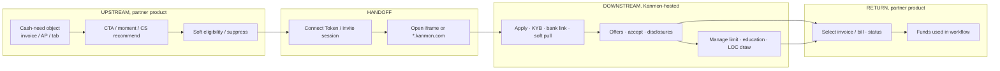

# Kanmon: partner ecosystem extension model

**Date:** 2026-07-29  
**Purpose:** How Kanmon extends into a partner ecosystem (upstream → handoff → downstream), reconciled with existing E2E diagrams / mocks / Capital Moments hyp. SMB shoes via Cleo InvoicePay.  
**Labels:** **[F]** = public fact · **[H]** = illustrated hypothesis · **[UNK]** = unknown / gated

**Companions**
- E2E journeys: `kanmon-partner-e2e-examples-20260729.md` (+ `.html`)
- Mid-fi mocks: `kanmon-partner-e2e-mocks-20260729.html`
- Partner vs direct: `kanmon-partner-vs-direct-20260729.md`
- Feature landscape: `kanmon-feature-landscape-20260729.md` (+ summary)
- Case bet: `kanmon-case-study-20260729.md` · Capital Moments HTML workbench
- **Cleo primary KB (Anthony, 2026-07-29):** `kanmon-source-library/cleo/webedi-invoice-financing-kb.md` · index `kanmon-source-library/README.md`

**Cleo KB correction note:** Confirms admin activate → Kanmon app → UW (often ≤24h) → offer/sign → finance-marked invoices in WebEDI → 30/60/90 → fund ≤24h. Strengthens **upstream discovery in partner chrome**. Does **not** name `cleo.kanmon.com` (marketing “no external portals”), hybrid portal model still **[F]** from portal + solutions FAQ. Repayment “when buyer pays” on KB **conflicts** with fixed ACH 30/60/90 FAQs → keep ACH as servicing **[F]**.

**Pressure-test (2026-07-29):** See `kanmon-source-check-20260729.md`. Portals are opaque SPAs (mocks illustrative). Rev share / bps = LinkedIn pitch, not FAQ. Design/admin Moments = concept gallery only. Capital Moments kill criteria still hold.

---

## 1. What is `cleo.kanmon.com` / `*.kanmon.com` / kanmonhq?

### Domain check (fetched 2026-07-29)

| Host | Result | Label |
|------|--------|-------|
| `https://cleo.kanmon.com/` | **Live** (HTTP 200). Next.js SPA shell on Vercel; HTML shell is empty until client JS; Segment analytics via `cdnseg.kanmon.dev`. Same pattern as `oncue.kanmon.com`, `cin7.kanmon.com`. | **[F]** |
| `https://cleo.kanmonhq.com/` | **Does not resolve / unreachable** (no useful DNS+TLS path from this environment). Anthony’s `cleo.kanmonhq.com` note is almost certainly a slip for `cleo.kanmon.com`. | **[F]** for failure; **[H]** for “slip” |
| `kanmonhq.com` / `www.kanmonhq.com` | **301 → `kanmon.com` / `www.kanmon.com`**. Legacy / brand alias, not a partner portal host. | **[F]** |
| `kanmon.com` | Platform / partner GTM site, **no** public SMB “Apply for a loan” funnel. | **[F]** |

### What the surface *is* (architecture)

Kanmon ships **three complementary surfaces**, not one:

| Surface | What it is | Evidence | Label |
|---------|------------|----------|-------|
| **Partner-branded hosted portal** (`{partner}.kanmon.com`) | Kanmon-hosted app under partner program name (e.g. “Cleo InvoicePay”). Used for invite/apply when the owner may not have EDI credentials; also “dedicated Kanmon account” login mentioned on Cleo marketing. | `cleo.kanmon.com` live; Cleo FAQ “log into your dedicated Kanmon account”; Oncue sunset page on `oncue.kanmon.com` | **[F]** |
| **SDK iframe inside partner app** | `@kanmon/web-sdk`: partner backend mints **Connect Token** → `KANMON_CONNECT.start()` → `KANMON_CONNECT.show()` opens **Kanmon Connect iframe**. Docs at `kanmon.dev` (invite-gated). | npm README | **[F]** |
| **Partner-native chrome** | CTAs, permissions, invoice/bill pickers, Financing tabs, rendered by partner product; Kanmon is rail underneath. | Cleo: Owner + “Use InvoicePay” → **Finance** on invoices after setup; PingPong Financing tab; Cin7 Money → Capital | **[F]** |

**ELI5:** Kanmon does **not** ask SMBs to discover “Kanmon.com” and apply. The partner puts a financing door *inside their software*. Opening that door either (a) loads Kanmon UI in an iframe, (b) sends the user to a partner-named `*.kanmon.com` page, or (c) mixes both. After approval, day-to-day “pick this invoice / bill and get cash” often returns to the **partner** UI. Kanmon remains the licensed lender, underwriter, funder, and servicer.

**Cleo-specific nuance [F]:** Marketing sometimes says “no external portals” (embedded narrative) *and* points to a dedicated Kanmon login + `cleo.kanmon.com` for application / owners without EDI logins. Treat as **hybrid**: apply/onboard can leave Cleo chrome; financing actions return to WebEDI.

---

## 2. ELI5 extension model

```
Partner software = where the cash need shows up (invoice, AP, payroll, peak season).
Kanmon          = the bank-in-a-box behind the partner brand.

Upstream   →  “Should we even show financing here?” (surface + soft gate + CS nudge)
Handoff    →  “Prove who this user is and open Kanmon’s apply/manage UI” (token / invite)
Downstream →  “Apply, get offers, accept, draw, repay, educate” (Kanmon-owned CVR)
Return     →  “Do work again in the partner app with cash in hand”
```

Origination that counts for the case metric = **`funding.settled`** through a partner path, not a logo signed, not a click, not an approved limit with $0 draws.  
(See E2E anti-examples in `kanmon-partner-e2e-examples-20260729.md`.)

---

## 3. Upstream ↔ handoff ↔ downstream map

Reconciles with E2E Scenario 1 swimlane + mocks persona flow. Labels match those docs.



### Stage detail

| Stage | What happens | Where it lives | Fact vs illustrated |
|-------|--------------|----------------|---------------------|
| **Discovery** | SMB sees unpaid invoice / Financing tab / Capital hub / CS tip | Partner UI | CTA placement **[F]** per partner; “Capital Moment” timing **[H]** (case bet) |
| **Soft gate** | Suppress ineligible / already declined / cooldown; optional soft invite copy | Partner + Kanmon eligibility API | Soft pull / US-only style rules **[F]** in FAQs; pre-CTA eligibility API **[H]** (handshake catalog) |
| **CTA click** | “Get Started” / Finance / Apply | Partner chrome | **[F]** |
| **Handoff** | Bind logged-in SMB (or email invite) to lending session | Connect Token **[F]** or invite to `cleo.kanmon.com` **[F]** | Exact redirect vs iframe per partner **[UNK]/often **[H]** when not stated |
| **Apply** | ~10–15 min business info + bank connect | Kanmon UI (iframe or subdomain) | Timing **[F]** partner FAQs |
| **Decision** | Soft credit pull + UW; offers in hours–few BD | Kanmon credit | Soft pull / timing **[F]** |
| **Accept** | Sign agreement / lock product-limit | Kanmon UI | **[F]** |
| **Enable in partner** | Finance controls appear on eligible objects | Partner UI after webhook/status | Enable Finance button **[F]** (Cleo); webhook mechanism **[H]** |
| **Draw / fund** | Select invoice(s) or AP bills / draw LOC | Often **partner** for object pick; Kanmon rails for ACH | Cleo invoice select in WebEDI **[F]**; PingPong fund-to-wallet **[F]** |
| **Service** | Balance, repay ACH, late/NSF fees, early-pay rebate | Kanmon portal and/or partner status | Fees / ACH **[F]**; partner ledger sync **[H]** |

### ASCII (matches E2E “cross-cutting system journey”)

```
┌──────────────────────┐   Connect Token / invite    ┌──────────────────────┐
│ UPSTREAM             │ ─────────────────────────► │ HANDOFF              │
│ Partner SaaS         │                             │ session.bind         │
│ · object / moment    │ ◄── webhooks / status ───── │ open iframe|subdomain│
│ · CTA / soft gate    │                             └──────────┬───────────┘
│ · CS recommend       │                                        │
│ · post-approval pick │                                        ▼
│   (invoice / bill)   │                             ┌──────────────────────┐
└──────────────────────┘                             │ DOWNSTREAM           │
         ▲                                           │ Kanmon platform      │
         │ funds used in workflow                    │ apply·offers·ledger  │
         │                                           │ KYB·soft pull·UW     │
         └──────── ACH / partner wallet ◄────────────│ fund·service         │
                                                     └──────────────────────┘
```

---

## 4. Upstream leverage vs downstream CVR (table)

| Lever | Upstream (partner product) | Downstream (Kanmon portal / iframe) | Who feels it | Case funnel link |
|-------|----------------------------|-------------------------------------|--------------|------------------|
| **Surface / moment** | Inline CTA on aging invoice; intensity controls; CS “recommend capital” | N/A if never opened | Partner eng + Kanmon growth PM | **B Surface** |
| **Eligible start** | Soft gate before noisy CTA; permission (Owner vs Operator) | Form length, bank-link UX, progress save | Product + Credit signals | **C Eligible start** |
| **Trust / brand** | Partner-branded copy (“Cleo InvoicePay”) | Kanmon disclosures / lender identity | Partner brand + Legal | Affects B→C |
| **Offer quality** | Pass rich context (invoice amount, counterparty, due date) **[H]** | Offer sheet clarity, amount, fees, expiry | Credit + Product | **D Offer→accept** |
| **Time-to-decision** | Status in partner (“Under review”) **[H]** | Wait-state education, email/SMS | Product + Ops | **D** drop while waiting |
| **First fund** | Make eligible objects obvious after approve | Draw UX, ACH explanation | Partner + Kanmon | **D Fund** |
| **Repeat / habit** | Finance stays on every future invoice | Limit increase, LOC draw, refinance upsell | Both | Repeat originations |
| **Quiet partner** | CS tooling, launch kits, SPIFs / rev share | Portal polish alone won’t fix buried CTA | GTM + PS + Product | **A×B** |

**PM owning partner originations, tradeoff**

| Put feature **partner-native** | Put feature **Kanmon portal / SDK** |
|--------------------------------|--------------------------------------|
| Wins **surface rate** and “in workflow” trust | Wins **apply→offer→fund CVR** and compliance consistency |
| Needs partner eng / design cycles (slow per logo) | Ships once; all partners inherit |
| Risk: partners fear looking like lenders | Risk: feels like leaving the product → abandon |
| Best for: moments, CTAs, object pickers, CS recommend | Best for: KYB, disclosures, offer accept, servicing, hard credit UI |

**Rule of thumb:** Anything that must fire *at the cash-need object* is upstream. Anything that is *regulated credit decisioning or money movement consent* is downstream. Capital Moments is almost entirely **upstream packaging** that hands off into existing downstream apply.

---

## 5. Access vs approval: “CVR at point of access”

### What is visible **before** KYB / decision **[F]** unless noted

| Visible | Not visible / not trustworthy yet |
|---------|-----------------------------------|
| Marketing promise (get paid faster, ~24h after *approved invoice selection*) | Hard pre-approved dollar amount (Kanmon public “pre-approved offer” product **[UNK]**; don’t invent $) |
| Partner CTA / Get Started / Financing tab | Per-invoice **Finance** action on Cleo, appears **after setup/approval complete** **[F]** |
| Soft invite language (“See if you qualify”) **[H]** as product pattern | Guaranteed approval |
| Soft credit pull disclosed as non-score-impacting **[F]** | Full limit / fee schedule before underwriting |

### What unlocks **after** approval **[F]**

- Program / limit accepted with Kanmon  
- Cleo: **Finance** on individual invoices; Operators can finance if permitted; Owners did company setup  
- Ability to select repayment term (30/60/90) per advance  
- Funding portal balance / history (Kanmon account and/or in-partner status)  
- Consolidation / refinancing explored during/after application path (partner FAQ)

### Implication for “CVR at point of access”

Two different conversion games:

1. **Access CVR (upstream):** of sessions with a cash-need object, % that *see* and *start*. This is Capital Moments territory. Measuring “portal CVR” here is the wrong instrument, the user never reached the portal.
2. **Completion CVR (downstream):** of starts, % that submit → get offer → accept → first fund. Portal/SDK UX owns this, but a beautiful apply flow cannot rescue a buried Finance tab.

**Approved-but-never-draws** is a third trap: access and approval succeeded; **origination still zero**. Post-approval partner UI (eligible invoice marked Finance) is as important as apply CVR.

---

## 6. Where Capital Moments would live

From case writeup + feature landscape source-check:

| Layer | Capital Moments ownership | Why |
|-------|---------------------------|-----|
| **Moment catalog + thresholds** | Kanmon-defined, partner-configured | Shared playbook across logos |
| **CTA / banner / post-action modal** | **Partner-native or SDK component props** | Must sit on invoice/AP object |
| **Soft eligibility / suppress** | Kanmon API + partner call before show | Avoid spam + bad credit traffic |
| **Intensity admin** | Partner admin (or Kanmon partner portal) | Brand fear / “don’t look like a lender” |
| **Apply / KYB / offers / accept** | **Existing Kanmon iframe / `*.kanmon.com`**. Moments should **not** rebuild this | Table stakes already shipped **[F]** |
| **Holdout + funnel events** | Both sides instrument | Prove incremental funded originations |

### What would **NOT** belong only in the Kanmon portal

- Detecting “this invoice is 45 days unpaid” without partner context  
- Inline Finance on the invoice row  
- CS agent “recommend capital” on a support ticket in the partner tool  
- Partner intensity / suppression preferences  
- Object picker for *which* invoice to accelerate (Cleo pattern keeps this in WebEDI **[F]**)

Portal-only Moments = a prettier Financing tab. That is **not** the bet.

Landscape caveat **[F/H]:** “Right capital at the right moment” is category language (Liberis Adverts, etc.). Kanmon’s differentiated wedge is more plausibly **vertical objects + multi-product routing + quiet-partner activation**, not inventing contextual offers as a category first.

---

## 7. Customer narrative: Cleo InvoicePay (SMB shoes)

**You** run a mid-size supplier. Your biggest retail buyer pays Net-60 through EDI. Freight and payroll hit this Friday. The invoice for last month’s shipment is sitting in Cleo WebEDI, approved by the buyer’s process, unpaid by the calendar.

**In the partner app.** You open WebEDI the way you always do: check ASNs, chase a missing PO change, scan open invoices. Cash anxiety is background noise until you see the aging balance and think *I can’t float another month of this.*

**What makes you click.** Either (a) your owner already flipped **Use Cleo InvoicePay** and a **Finance** control sits on the invoice itself, the need and the button share a screen, or (b) you got an email invite because the owner doesn’t even have an EDI login, pointing you to **`cleo.kanmon.com`**. Curiosity + relief: financing showed up where the unpaid invoice lives, not in a cold Google ad for “business loan.”

**What the subdomain feels like.** `cleo.kanmon.com` still says Cleo InvoicePay, but the chrome is quieter, more “lender application.” You log in with the invite email. ~15 minutes: business facts, bank connect, soft-pull consent. It feels like leaving the EDI cockpit, necessary, slightly trust-taxing. You wonder if this is still “Cleo” or a stranger named Kanmon (disclosures say Kanmon is the lender). You finish because payroll is real.

**Apply → wait.** You submit. Soft pull, underwriting. Maybe hours, maybe up to a few business days. Emotion: impatience. Drop risk: silence. If Cleo/Kanmon don’t show status in the place you already work, you stop checking.

**Fund.** Offer lands; you accept. Back in WebEDI, Finance is alive on eligible invoices. You pick the big unpaid one, choose 30/60/90, confirm. Same-day ACH story, funds hit; the buyer relationship doesn’t change. Emotion: control. You finance *this* invoice, not your whole book.

**Back to partner work.** Tomorrow you’re shipping again in the same portal. Finance is now a habit tool, not a one-off loan site. Drop risks from here: NSF on repayment ACH, late fees, or never drawing again because the CTA wasn’t on the next painful invoice.

**Emotional beats (one line):** anxious float → relief at in-workflow door → friction at bank link → hope in wait → agency at first finance → habit or churn on repay.

*(Persona + stages align with E2E Scenario 1 customer journey table and mocks “SMB operator” path, those mocks are mid-fi illustrations; this narrative stays on **[F]** Cleo/Kanmon public steps and labels gaps as **[H]**.)*

---

## 8. Implications for the case bet (partner-sourced originations)

1. **Metric is the whole board.** Public GTM is partner-distributed (`kanmon-partner-vs-direct-20260729.md`). “Originations through partner platforms” ≈ company originations, not a channel slice.
2. **Extension model explains quiet partners.** Integration can be “live” (SDK + subdomain) while **upstream surface ≈ 0**. Fixing downstream apply CVR won’t move the north star.
3. **Capital Moments maps cleanly to extension seams:** upstream moment + soft gate → existing handoff (Connect Token / invite) → unchanged downstream apply. That is product judgment: leverage shipped rails.
4. **Don’t over-index portal polish in the interview** unless funnel data shows start→fund breakage. Lead with see→start on live partners; keep portal CVR as second wager.
5. **Access ≠ approval ≠ origination.** Design and metrics must separate surface, eligible start, offer/accept, and **first + repeat `funding.settled`**.
6. **Capability vs incentive** still applies (partner-vs-direct doc): Moments is a capability bet; if attach is low with healthy funnels, reach for CS SPIFs / rev share instead of more UI.

**Interview line:**  
> “Kanmon extends by putting partner-branded doors inside SaaS, subdomain or SDK iframe, while the cash-need object stays in the partner. I’d grow originations by raising upstream surface × eligible start at those objects, then converting through the existing Kanmon apply rail, not by building a direct Kanmon.com borrower funnel.”

---

## 9. Sources

**Fetched / probed**
- https://cleo.kanmon.com/ (live SPA shell)
- https://cleo.kanmonhq.com/ (unreachable)
- https://kanmonhq.com → https://kanmon.com
- https://www.cleo.com/solutions/invoice-financing
- https://www.cleo.com/blog/knowledge-base-webedi-invoice-financing
- Cleo support: Cleo InvoicePay™ setup / Kanmon about
- https://www.npmjs.com/package/@kanmon/web-sdk · https://unpkg.com/@kanmon/web-sdk@2.2.13/README.md
- https://github.com/Kanmon/sdk (docs → kanmon.dev gated)
- https://oncue.kanmon.com/ · https://cin7.kanmon.com/ (same SPA pattern)

**Internal reconcile**
- `ops/drafts/prep/kanmon-partner-e2e-examples-20260729.md`
- `ops/drafts/prep/kanmon-partner-e2e-mocks-20260729.html`
- `ops/drafts/prep/kanmon-partner-vs-direct-20260729.md`
- `ops/drafts/prep/kanmon-feature-landscape-*.md`
- `ops/drafts/prep/kanmon-case-study-20260729.md`
