# Soft pre-check + partner prefill: architecture by product type

**Date:** 2026-07-30  
**Status:** Exploration package, design for deep dive, not a shipped spec  
**Companions:** [partner types × data](kanmon-f15-partner-types-data-20260730.md) · [two birds](kanmon-f15-soft-preauth-two-birds-20260730.md) · [drive-down](kanmon-drive-down-submission-experience-20260730.md) · [partner E2E](kanmon-partner-e2e-examples-20260729.md) · [copy sheet](kanmon-preauth-partner-copy-20260730.md) · [lift assumptions](kanmon-preauth-funnel-lift-assumptions-20260730.md)  
**Default view:** main workbench **Solve → Architecture** (`#architecture`) in [kanmon-case-study-capital-moments.html](kanmon-case-study-capital-moments.html)  
**Standalone diagrams HTML (optional):** [kanmon-preauth-architecture-diagrams-20260730.html](kanmon-preauth-architecture-diagrams-20260730.html)

**Volumes in related funnel work are simulated**, not Kanmon disclosed counts.

---

## What this is

Partner soft pre-check + prefill so:

1. People who already started finish submit more often (shorter apply, fewer “I don’t have this on hand” exits).
2. Partner surfaces can invite with honest low-effort copy when soft state allows, without pretending someone is approved for a dollar amount.

**Hard lines**

| Do | Don’t |
|----|-------|
| Soft eligibility / “worth checking” | “You’re approved for $X” in partner UI |
| Prefill identity + object context | Partner UI shows hard credit decision |
| Pre-check broadly on the partner surface in scope | Gate soft pre-check only to “people who look like they need financing” |
| Calm “no need / not now” path | Shame, dead end, or pushy follow-up |
| UW/DS own credit models | PM claims to fix the risk box via UX |

**Anthony’s rule:** if someone is in scope for the soft program path on that partner, run soft pre-check / eligibility awareness. Some won’t need financing. Design for that without treating them as a fail.

Thin SaaS long-tail (archetype F): **deferred**, same as partner-types map.

---

## Diagrams first

Start here. Prose below fills contracts and product nuance.

### 1 · Systems and trust boundary

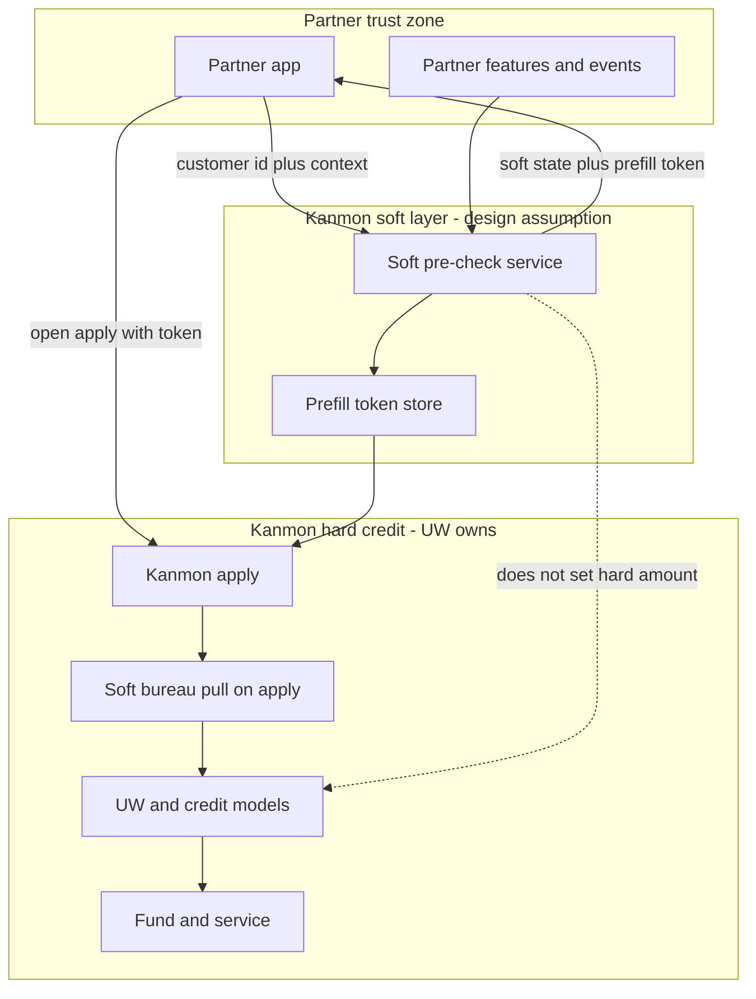

Soft pre-check ranks invite and hydrates apply. It does not mint a hard approval amount. UW and credit models own the hard decision after submit.

---

### 2 · Who enters soft pre-check

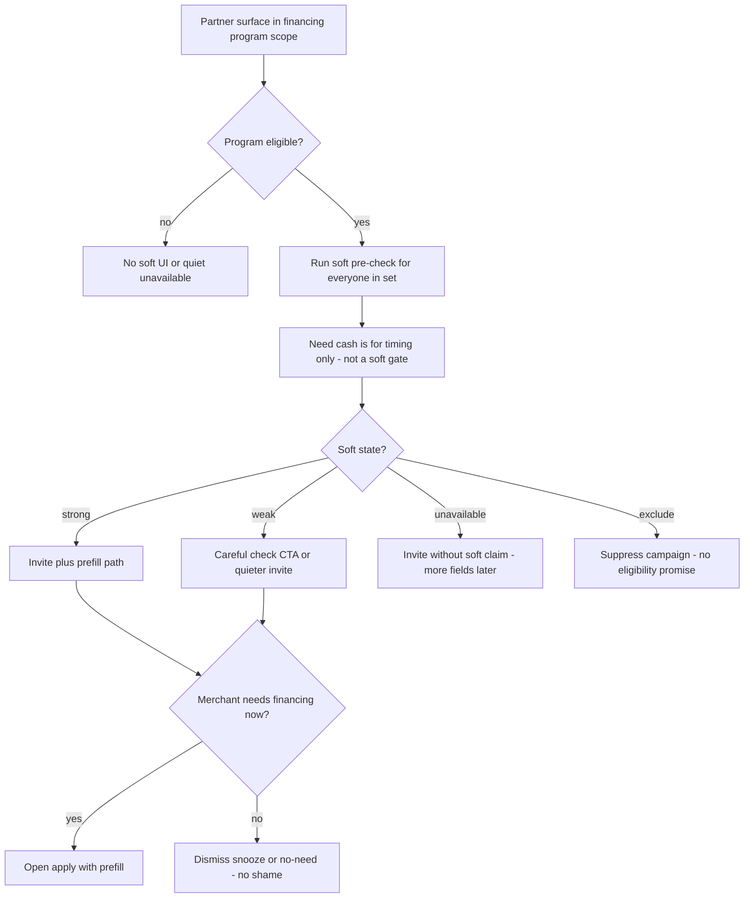

Program eligibility decides who gets a soft check. Cash need decides when to nudge, not whether soft runs.

| Concept | Meaning |
|---------|---------|
| **Program eligibility** | Partner + Kanmon say this account can see the financing program (geo, activation, entity type). |
| **Need** | Cash pressure / object due, useful for *when* to surface, not for *whether* soft pre-check runs. |
| **Intent** | Click / start apply, already strong once they start; soft pre-check also helps people who never clicked. |
| **Soft signal** | Invite / prefill / campaign rank only. Not a hard approval. |

**“No need / not now”:** soft may still pass. UI offers dismiss, snooze, or “I don’t need this” without blocking core partner work. No shame copy. Optional quiet reminder later with cooldown, not SMS-first.

---

### 3 · Where soft plugs into the funnel

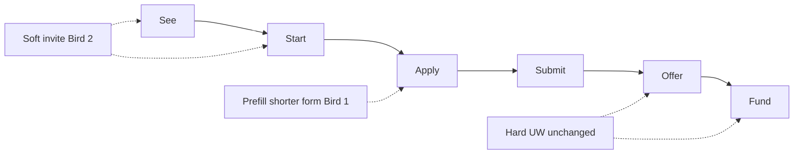

| Stage | Soft pre-check role |
|-------|---------------------|
| See / visibility | Object-tied or hub CTA can say checking is quick, only if soft + short apply are real |
| Start | Hand off with session + prefill payload so start isn’t a blank form |
| Apply | Prefill identity / object; progress honest; soft expectation set |
| Submit | Same submit event as today |
| Offer → Fund | Unchanged. UW hard decision; partner never shows hard approve $ in soft UI |

---

### 4 · End-to-end sequence

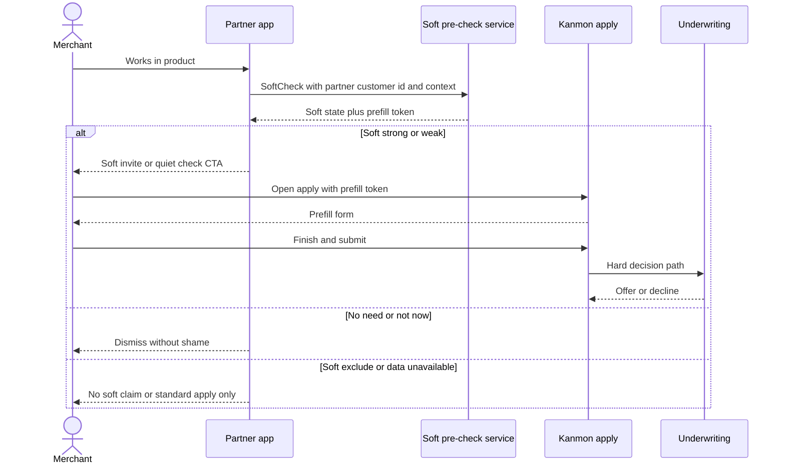

Partner calls soft; soft returns state + token; apply still goes to UW for the hard path. Soft strong is not “approved for $X.”

---

## Locked facts vs design assumptions

| Locked (from prep / public partner docs) | Design assumption (label clearly) |
|------------------------------------------|-----------------------------------|
| Products: invoice, AP, term, LOC on Kanmon shelf | Soft-rule thresholds Credit/Legal will approve |
| Partners on shelf: Cleo-like invoice/EDI, PingPong-like wallet, Cin7-like ERP, Nuvei-like payments, Avionté-like staffing | Exact fields already shared today vs new consent |
| Soft credit pull exists on apply; Kanmon is lender | Soft pre-check service is a new Kanmon capability + partner pipes |
| Apply often marketed &lt;10–15 min; funds often ≤1–2 days | Prefill cuts mid-form abandon enough to move Start→Submit ~+10 pts (medium t-shirt) |
| Partner portals opaque SPAs, journey from FAQ/KB, not pixel UI | Embed/SDK/redirect shapes below |
| Rich archetypes need new pipelines (consent, features, events, soft rules) | MVP = one design partner (invoice or wallet) × prefill + one in-product invite string |

---

## Systems contracts (partner ↔ Kanmon)

### Data flow overview

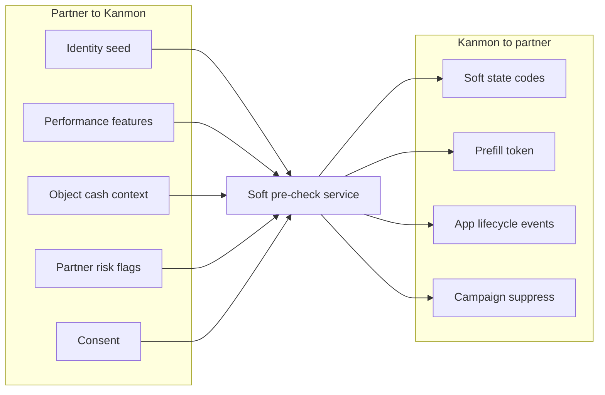

Partner sends features and events, not a raw ledger. Soft returns coarse state, never hard score or approve amount.

### Data in (partner → Kanmon)

| Class | Examples | Soft use |
|-------|----------|----------|
| Identity seed | Legal name, address, tax ID if held, DBA | Prefill |
| Firmographics | Industry, tenure on platform, entity type | Soft segment |
| Performance | Volume proxies, invoice count, payout history | Soft rank |
| Object / cash context | Invoice $, due, PO $, AP due, wallet shortfall | Moment + ticket hint |
| Risk flags partner already has | Suspension, chargebacks, past-due to platform | Soft exclude |
| Consent | Financing + data-share, marketing opt-in | Legal basis |

Partner should send **features and events**, not a raw ledger dump. Bank/Plaid stays on Kanmon apply unless partner only sends a boolean like “verified payout account.”

### Data out (Kanmon → partner)

| Out | Partner may see | Partner must not see |
|-----|-----------------|----------------------|
| Soft state | `strong` / `weak` / `unavailable` / `exclude` + coarse reason codes | Hard credit score, model features, approve amount |
| Prefill token | Opaque handle to hydrate apply | Raw UW internals |
| Application events | started, submitted, decisioned, funded (existing pattern) | Full decline taxonomy internals if Legal says no |
| Campaign suppress | cooldown, opt-out |, |

### Auth

- Partner-authenticated session → Kanmon session bind (`partner_id`, `external_user_id`, roles).
- Soft check and prefill require **data-share + financing consent** (or equivalent contract).
- Idempotent soft check keyed by `(partner_id, partner_customer_id, context_hash, as_of)`.

### Events (illustrative names: design assumption)

| Event | Direction | Job |
|-------|-----------|-----|
| `soft_check.requested` | Partner → Kanmon | Evaluate soft state |
| `soft_check.completed` | Kanmon → Partner | State + reason codes + prefill token TTL |
| `context.pushed` | Partner → Kanmon | Invoice/PO/wallet object |
| `prefill.hydrated` | Kanmon internal | Apply session filled |
| `application.submitted` | Existing | Unchanged |
| `decision.rendered` | Existing | Hard offers, not soft UI |
| `campaign.trigger` | Kanmon → Partner / email | Good-candidate only; intensity caps |

### Failure modes

| Failure | Partner UX | Soft claim |
|---------|------------|------------|
| Soft service timeout | Fall back to standard apply CTA | No “you look like a fit” |
| Incomplete identity | Soft `unavailable`; apply collects fields | No overclaim |
| Stale features | Soft `weak` or suppress campaign | Prefer silence over wrong confidence |
| Soft strong → later hard decline | Expectation language was soft; show clear next steps | Measure false-hope rate |
| Prefill mismatch | Merchant corrects fields; log conflict | Don’t block submit |

### Idempotency and PII

- Soft check: safe to retry; same key → same state within freshness window.
- Prefill token: short TTL; single-use or rotate on hydrate.
- Minimize PII in partner webhooks; prefer opaque IDs + reason codes.
- Soft pull on full apply remains Kanmon’s; soft pre-check is **not** a substitute hard bureau decision unless Credit says otherwise (**design assumption:** soft layer uses partner features + light rules first).

---

## End-to-end by product type

Defer **thin SaaS**. Below: rich archetypes from the locked map. Overview first, then per-type sequences.

### Product overview

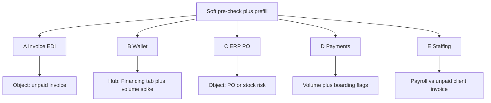

Same soft contract; the trigger object and partner moment change by archetype.

---

### A · Invoice / EDI (Cleo-like)

**Merchant job:** Get paid faster on an unpaid invoice while buyer keeps terms.

**Partner moment:** Finance control on invoice / aging AR (public fact pattern).

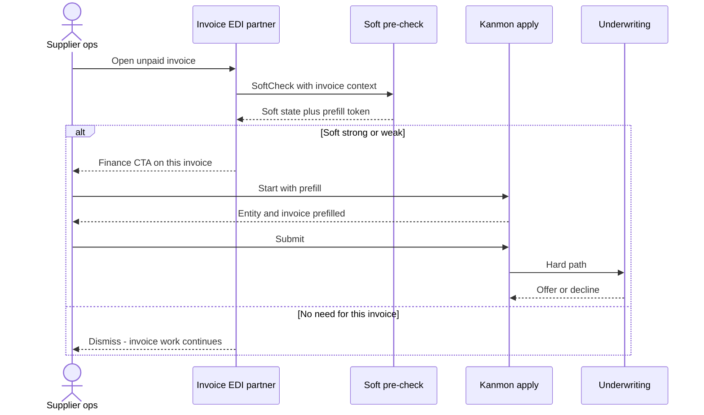

| Step | What happens |
|------|----------------|
| 1 | Invoice context → soft check (amount, due, buyer, activation state) |
| 2 | Soft strong/weak → object CTA: check funding for *this* invoice |
| 3 | Prefill entity + invoice object into apply |
| 4 | Submit → UW → offers → enable draws on invoices |

**No-need path:** “Not for this invoice” / dismiss; invoice workflow continues.

**Partner never shows:** approved advance $.

---

### B · Wallet / cross-border payments (PingPong-like)

**Merchant job:** Stock or pay suppliers without draining ops cash; funds often land in wallet.

**Partner moment:** Financing tab + (design assumption) event when large supplier pay or volume spike.

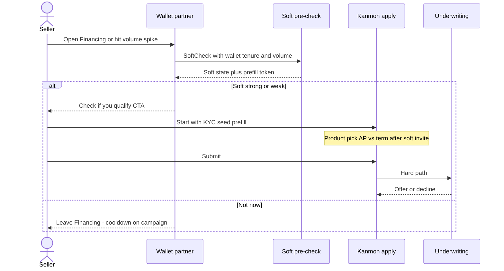

**Soft + prefill:** wallet tenure/volume aggregates → soft; prefill KYC seed if partner holds it (**hyp** on field map). Product pick AP vs term after soft invite.

**No-need path:** leave Financing; no campaign spam if they dismissed recently.

---

### C · ERP / PO / inventory (Cin7-like)

**Merchant job:** Pay supplier PO / restock before sell-through.

**Partner moment:** Money → Capital hub today (**public fact**); design assumption adds PO-approved / stock-risk event → soft invite on *that* PO.

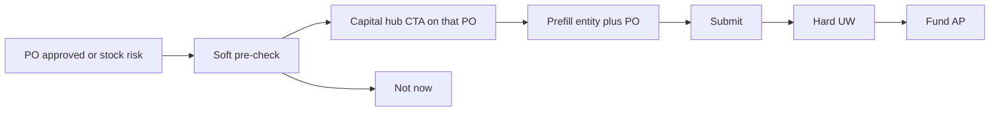

Soft invite is PO-tied; soft UI must not imply stacking products (Cin7-like: one active financing type at a time).

**Soft + prefill:** PO amount, supplier, due → object context; entity from ERP. Heavier pipeline (messy objects).

**Constraint to respect:** one active financing type at a time on Cin7-like help docs, soft UI shouldn’t imply stacking products.

---

### D · Payments processor (Nuvei-like)

**Merchant job:** Working capital against processed volume / settlement timing.

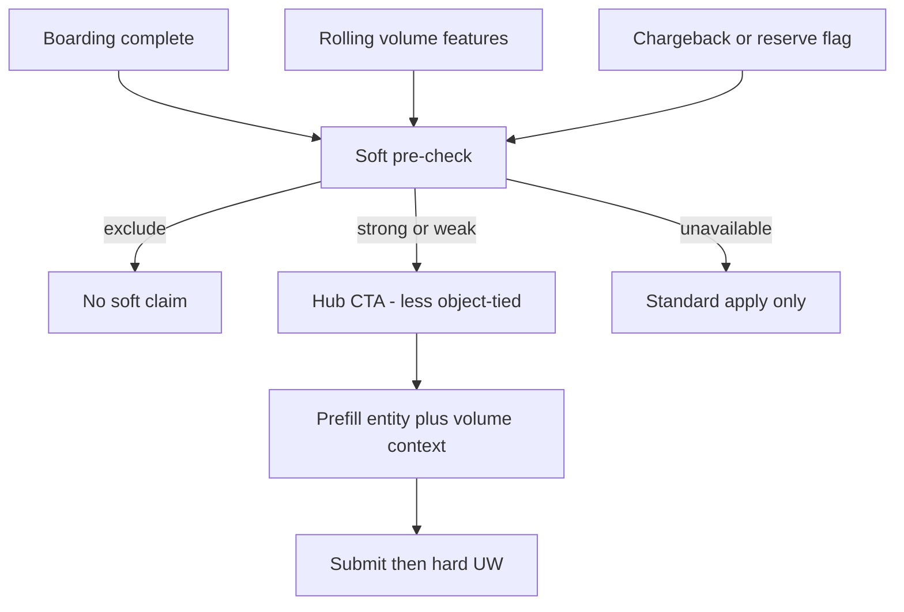

**Soft + prefill:** rolling volume features + boarding-complete flag; chargeback/reserve → soft exclude. Medium–strong fit; less object-tied than invoice/PO.

---

### E · Staffing / vertical ops (Avionté-like)

**Merchant job:** Bridge payroll vs client invoice pay.

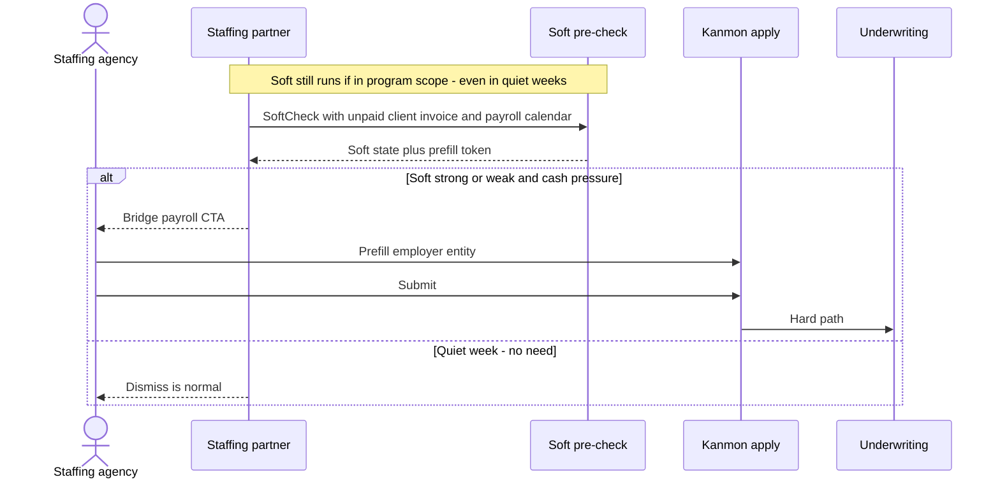

**Soft + prefill:** invoice-approved-unpaid + payroll calendar events → soft; prefill employer entity. “No need” common in quiet weeks, still ran soft if in program scope; dismiss is normal.

---

## MVP cut (practical)

| In | Out |
|----|-----|
| One design partner: invoice **or** wallet | Universal partner-data lake |
| Soft check + prefill + one in-product string | Full campaign engine day one |
| Soft states + no-need dismiss | Hard $ in partner UI |
| Instrument Start→Submit and soft→hard outcomes | SMS as primary channel |

If Credit/Legal or partner share isn’t ready in a short window: ship in-flow apply UX (progress, clearer handoff, save state) first; keep soft pre-check as the next step on the same story.

---

## Open questions

1. Which fields do top partners already send vs portal-only?
2. Soft-rule ownership: Credit template PM can productize, or Credit-only?
3. Freshness SLA for volume features?
4. Design partner pick: invoice vs wallet first?

---

## Package index

| Artifact | Path |
|----------|------|
| This architecture | `kanmon-preauth-architecture-by-product-20260730.md` |
| Diagrams HTML | `kanmon-preauth-architecture-diagrams-20260730.html` |
| Partner copy | `kanmon-preauth-partner-copy-20260730.md` |
| Experience mock | `kanmon-preauth-experience-mock-20260730.html` |
| Funnel lift Sankey | `kanmon-funnel-lift-sankey-20260730.html` |
| Lift math | `kanmon-preauth-funnel-lift-assumptions-20260730.md` |
